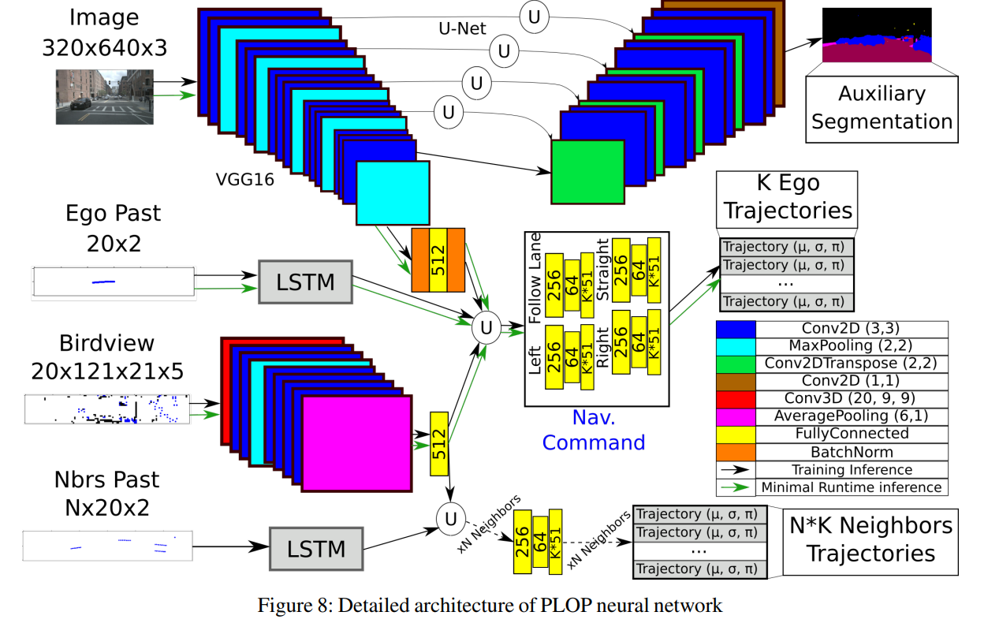

# PLOP: Probabilistic poLynomial Objects Trajectory Prediction

## Overview

This repository contains the PyTorch unofficial implementation of the PLOP model for predicting multiple feasible future trajectories for both the ego vehicle (autonomous vehicle) and its neighboring vehicles. The model is based on the research paper "PLOP: Probabilistic poLynomial Objects trajectory Prediction for autonomous driving". We implement this model in order to analyze the performance of our safety assessment models and personal focus models (remain added). Note: This repository is still under development and maintenance.

## Key Features

- Predicts multiple feasible future trajectories for both ego and neighboring vehicles.
- Utilizes a conditional imitation learning algorithm.
- Processes front-facing camera images, Lidar point clouds, and past and present object detections.
- Relies solely on on-board sensors, eliminating the need for HD maps.
- Achieves state-of-the-art performance on the nuScenes dataset.

## Model Architecture

The PLOP model consists of two main components: an encoder and a predictor. The encoder synthesizes information from various inputs such as front-facing camera images, Lidar point clouds, and past trajectories. The predictor processes this information to output multiple feasible future trajectories for both the ego vehicle and its neighboring vehicles.

### Encoder

- Front camera image: Encoded by a VGG16 network.
- Bird-eye views (BEVs): Encoded by a CNN with 3D convolutional layers.
- Past trajectories: Encoded using an LSTM layer.

### Predictor

- Auxiliary U-net semantic segmentation decoder: Injects an awareness of scene layouts.
- Neighbors' trajectories prediction: Utilizes fully connected (FC) layers to output a multivariate Gaussian mixture.
- Ego vehicle trajectory prediction: Similar to neighbors but adds image encoding as an input and a conditional dimension to the FC layers.

## Prerequisites

- Python 3.10
- PyTorch
- NumPy
- (Any other dependencies)

## Contributing

Feel free to contribute to this project by submitting issues or pull requests.

## License

This project is licensed under the MIT License - see the [LICENSE.md](LICENSE.md) file for details.

## Acknowledgments

- Original paper: [PLOP: Probabilistic poLynomial Objects trajectory Prediction for autonomous driving](https://arxiv.org/pdf/2003.08744.pdf)
- (Any other acknowledgments)
